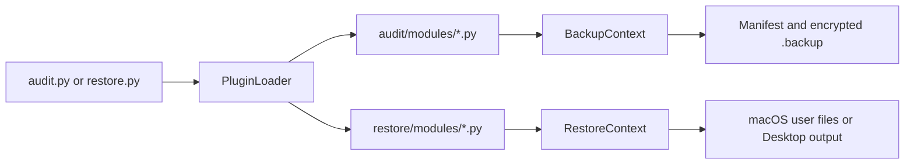
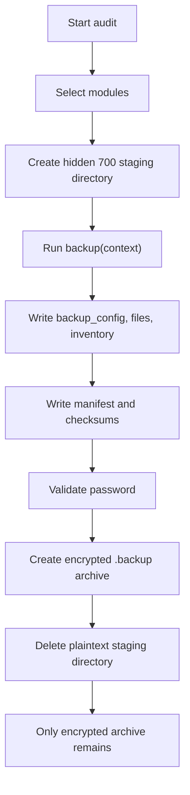
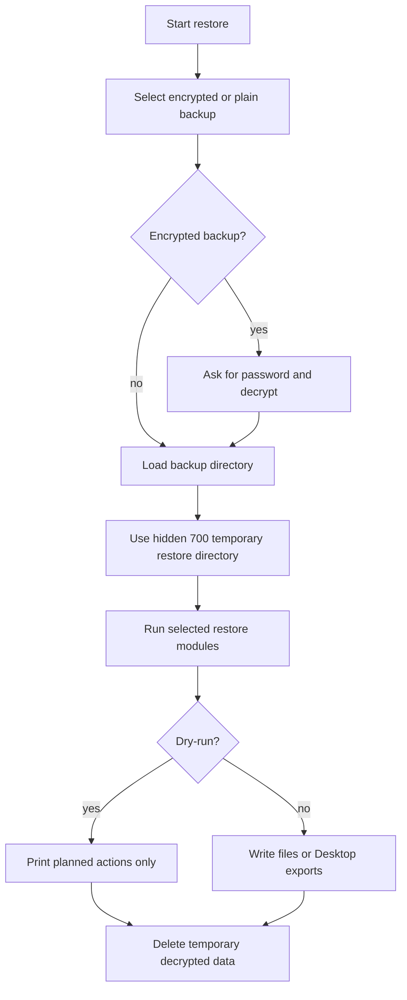
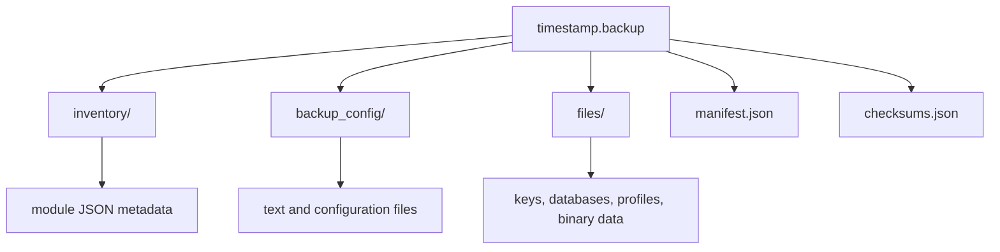
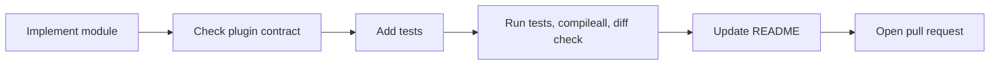

Mac Restore - Backup & Recovery Framework
Version: 1.0.1
A modular Python framework designed for macOS developers to specifically back up and restore configurations, SSH keys, local databases, system keychains, and development environments. It acts as a surgical tool to complement standard full-system backups (like Time Machine), ensuring no unnecessary cache or heavy redundant files are stored, while preserving critical uncommitted data (e.g., .env files) and system preferences.
Table of Contents

1. Overview & Workflow
2. System Requirements
3. Usage
4. Backup Structure
5. Core Components
6. Modules Directory
7. Adding Backup and Restore Modules
   Overview & Workflow
   The framework operates through two symmetrical engines: Audit (Backup) and Restore (Recovery).
   - Interactive Selection: Both engines feature an interactive CLI menu allowing the execution of all modules or a specific subset. Target and source directories can be selected via native macOS Finder prompts.
   - Routing & Segregation: Data is automatically sorted based on its nature: lightweight text/configurations are stored separately from heavy binary files or databases.
   - Data Integrity: Every backup generates a manifest.json and a checksums.json (SHA-256) to cryptographically validate file integrity over time.
   - Encrypted Backups: New backups are compressed and encrypted as a single AES-256-GCM archive. The password is never saved. New passwords must contain at least 8 characters, including an uppercase letter, a lowercase letter, a number, and a special symbol.
   - Safe Execution (User Space): The framework operates entirely within the user space (~/). It does not require and should not be run with root or sudo privileges.
   - Dry-Run by Default: The Restore engine defaults to a simulated execution mode. It calculates paths and displays proposed changes without modifying the disk, preventing accidental data overwrites on fresh installations.
   - Concise Progress: Long-running modules display a terminal spinner and finish with aggregate counts instead of printing every copied file.
   System Requirements
   To allow the Python scripts to access sensitive macOS directories (such as Keychains) and external drives, you must grant the terminal emulator (e.g., Terminal.app, iTerm2, or your IDE's integrated terminal) the appropriate permissions.
7. Open System Settings > Privacy & Security > Full Disk Access.
8. Toggle the switch to enable access for your terminal application.
   Usage
9. Creating a Backup (Audit)
   Launch the audit script to scan and copy files to the default backups/ directory or an external drive. At the end, it asks twice for an encryption password of at least 8 characters containing an uppercase letter, a lowercase letter, a number, and a special symbol. Plaintext data is staged in a hidden `.macrestore-*` system temporary directory with `700` permissions. It is permanently deleted after encryption, leaving only the encrypted `.backup` archive in the destination. If the operation is interrupted, the plaintext staging directory is removed before exit.
   python3 audit.py

10. Restoring a Backup (Restore)
    The restore engine lists all backups found in the default folder, marks the newest one, and lets the user select a backup by number without pressing Enter. Option `0` opens Finder for a folder containing a backup; its contents are then listed for selection. The selected backup name is displayed before the restore-module menu.
    Simulated Run (Dry-Run):
    Executes the script safely, printing actions to the console without writing data.
    python3 restore.py

Actual Execution:
Overrides the safety lock and writes data to the system.
    python3 restore.py --execute

    Encrypted backups ask for their password before the restore menu. Existing unencrypted backup folders remain supported.

    During restore, the encrypted archive is decrypted only after the correct password is entered, into a hidden `700`-permission temporary directory. That directory is permanently deleted when the restore process ends, leaving the encrypted archive as the only backup artifact.

Backup Structure
Each backup generates a timestamped directory (e.g., 2026-08-04_115708/) containing a strictly organized tree:
Directory/File Content & Purpose
inventory/ Generated .json metadata files from each module. Contains execution logs, file counts, and original system paths.
backup_config/ Plain text configurations. Stores .zshrc, Brewfile, IDE .json settings, and system analysis logs.
files/ Heavyweight and binary data. Stores SQL dumps, Obsidian Vaults, Keychain databases (.keychain-db), SSH keys, and VPN profiles.
manifest.json Overall backup metadata (timestamp, user, system info).
checksums.json Cryptographic hashes for validating the integrity of the backed-up files.
Core Components
- audit.py & restore.py: The main entry points. They handle the CLI interface, parsing arguments, displaying mode warnings (Dry-Run vs. Real), and triggering native AppleScript prompts.
- config.py: Intercepts environment variables set by the CLI and defines absolute paths for the entire project.
- audit/engine.py & restore/engine.py: The core processors. They dynamically load plugins from the modules/ directories, isolate execution environments, and manage directory mapping (Context).
- shared/: Shared libraries utilized by both engines (inventory.py for logging, checksum.py for cryptography, verify.py for validation, and plugin_loader.py).
Modules Directory
Modules are independent, domain-specific scripts. The Backup phase consists of 19 modules, while the Restore phase consists of 16 modules. The `disk_usage` backup module is optional and is excluded from the default "all standard modules" selection; its report is handled by `system_lists` during restore. The Restore phase also skips the hardware snapshot (`system`).
The Restore phase utilizes two distinct deployment strategies:
- Direct Injection: Files are injected directly into their original macOS system paths.
- Safe Extraction: Files requiring manual import or third-party software installation (e.g., Databases, VPNs) are extracted to organized folders on the ~/Desktop.
- vmware.py: Records VMware Fusion `.vmwarevm` bundle locations and validates them during restore. It intentionally does not copy virtual disks; the bundle remains on the external drive.
Security & Access
Plaintext staging and restore directories are hidden from casual browsing and restricted to the current user with filesystem mode `700`. No special system permission is required to use the system temporary directory. Full Disk Access may still be required for protected backup sources such as Keychains and application data.
- password.py: Backs up and directly injects macOS Keychains (login.keychain-db). Creates a pre-restore backup of the existing keychain to prevent lockouts.
- ssh.py: Backs up and directly injects public/private keys and configs. Crucial: Dynamically enforces 700 permissions on ~/.ssh and 600 on key files to satisfy OpenSSH security requirements.
- vpn.py: Safely extracts Tunnelblick (.tblk) and OpenVPN (.ovpn) profiles to the Desktop for manual re-import.
Web Development, Projects & Databases
- git.py: Backs up and injects the global .gitconfig.
- git_ignored.py: Backs up uncommitted local files (e.g., .env) while ignoring node_modules or build artifacts. On restore, it directly injects the entire tree over the home directory, dropping secret files into their exact respective Git repository folders.
- mysql.py: Backs up local databases (excluding system DBs) into .sql.gz archives and safely extracts them to the Desktop.
- workbench.py: Backs up and injects connections.xml to restore MySQL Workbench server credentials and hosts.
- node.py: Backs up and injects global configurations (.npmrc, .yarnrc) and extracts JSON lists of globally installed packages.
Mobile Development & IDEs
- mobile_dev.py: Injects Android debug.keystore and Xcode Provisioning Profiles into system paths; safely extracts production .jks keys to the Desktop.
- antigravity.py: Injects settings.json, keybindings, and snippets for IDEs (VS Code, Trae). Extracts the extension list (extensions.txt) to the Desktop.
Browsers & Remote Tools
- browser.py: Backs up and injects configurations for Google Chrome and Arc Browser. It separates encrypted login databases from standard preferences during backup, merging them back accurately during restore.
- remote_tools.py: Backs up and surgically injects configuration directories and .plist preferences for Termius, AnyDesk, TeamViewer, and FileZilla.
Productivity & Notes
- obsidian.py: Reads Obsidian registry to locate Vaults. Backs them up while omitting heavy Electron caches (Crashpad, GPUCache). On restore, injects global preferences and extracts the Vaults to the Desktop.
System & Maintenance
- development.py: Backs up and injects shell initialization files (.zshrc).
- system_lists.py (Restore Only): Consolidates the output of the applications, homebrew, and disk_usage backup modules. Generates a folder on the Desktop containing the Brewfile and plain-text application lists for rapid system provisioning.
Mac Restore - Backup & Recovery Framework (Italiano)
Versione: 1.0.0
Un framework modulare in Python progettato per gli sviluppatori macOS per il backup e il ripristino mirato di configurazioni, chiavi SSH, database locali, portachiavi di sistema e ambienti di sviluppo. Agisce come uno strumento chirurgico per integrare i backup completi di sistema (come Time Machine), assicurando che non vengano archiviate cache inutili o file pesanti ridondanti, preservando al contempo dati critici non tracciati (es. file .env) e le preferenze di sistema.
Indice

1. Panoramica e Flusso di Lavoro
2. Requisiti di Sistema
3. Utilizzo
4. Struttura del Backup
5. Componenti Core
6. Elenco Moduli
   Panoramica e Flusso di Lavoro
   Il framework opera attraverso due motori simmetrici: Audit (Salvataggio) e Restore (Ripristino).
   - Selezione Interattiva: Entrambi i motori dispongono di un menu CLI interattivo che consente l'esecuzione di tutti i moduli o di un sottoinsieme specifico. Le directory di origine e destinazione possono essere selezionate tramite finestre native del Finder di macOS.
   - Routing e Separazione: I dati vengono smistati automaticamente in base alla loro natura: configurazioni leggere di testo vengono separate da file binari pesanti o database.
   - Integrità dei Dati: Ogni backup genera un manifest.json e un checksums.json (SHA-256) per validare crittograficamente l'integrità dei file nel tempo.
   - Backup Cifrati: I nuovi backup vengono compressi e cifrati in un unico archivio AES-256-GCM. La password non viene mai salvata. Deve avere almeno 8 caratteri, una maiuscola, una minuscola, un numero e un simbolo speciale.
   - Esecuzione Sicura (User Space): Il framework opera interamente all'interno dello spazio utente (~/). Non richiede e non deve essere eseguito con privilegi di root o sudo.
   - Dry-Run di Default: Il motore di ripristino è preimpostato su una modalità di esecuzione simulata. Calcola i percorsi e mostra a schermo le modifiche proposte senza scrivere sul disco, prevenendo la sovrascrittura accidentale di dati su installazioni pulite.
   - Avanzamento Sintetico: I moduli lunghi mostrano uno spinner nel terminale e terminano con conteggi aggregati invece di stampare ogni file copiato.
   Requisiti di Sistema
   Per consentire agli script Python di accedere a directory sensibili di macOS (come i Portachiavi) e alle unità esterne, è necessario concedere all'emulatore di terminale (es. Terminale.app, iTerm2 o il terminale integrato nell'IDE) i permessi appropriati.
7. Aprire Impostazioni di Sistema > Privacy e Sicurezza > Accesso completo al disco.
8. Attivare l'interruttore per abilitare l'accesso per l'applicazione terminale utilizzata.
   Utilizzo
9. Creare un Backup (Audit)
   Avviare lo script di audit per scansionare e copiare i file nella directory predefinita backups/ o su un disco esterno. Al termine viene richiesta due volte una password di almeno 8 caratteri, con maiuscola, minuscola, numero e simbolo speciale. I dati in chiaro vengono preparati in una directory temporanea di sistema nascosta `.macrestore-*`, con permessi `700`. Dopo la cifratura viene eliminata definitivamente e nella destinazione rimane solo l'archivio `.backup`. Se l'operazione viene interrotta, la directory temporanea viene rimossa prima dell'uscita.
   python3 audit.py

10. Ripristinare un Backup (Restore)
    Il motore di ripristino elenca tutti i backup presenti nella directory predefinita, evidenzia quello più recente e consente di selezionare il backup tramite numero senza premere Invio. L'opzione `0` apre il Finder per scegliere una cartella contenente un backup; il contenuto viene poi elencato per la selezione. Il nome del backup scelto viene mostrato prima del menu dei moduli.
    Esecuzione Simulata (Dry-Run):
    Esegue lo script in sicurezza, stampando le azioni nella console senza scrivere alcun dato.
    python3 restore.py

Esecuzione Reale:
Disabilita il blocco di sicurezza e scrive fisicamente i dati sul sistema.
python3 restore.py --execute

I backup cifrati richiedono la password prima del menu di ripristino. Solo dopo l'inserimento corretto vengono decrittati in una directory temporanea nascosta con permessi `700`, eliminata definitivamente alla fine del processo. Nella destinazione rimane solo l'archivio `.backup`. Le cartelle di backup non cifrate esistenti restano supportate.

Struttura del Backup
Ogni backup genera una directory provvista di timestamp (es. 2026-08-04_115708/) contenente un albero rigorosamente organizzato:
Directory/File Contenuto e Scopo
inventory/ File metadati .json generati da ciascun modulo. Contengono log di esecuzione, conteggio dei file e percorsi di sistema originali.
backup_config/ Configurazioni in testo puro. Archivia .zshrc, Brewfile, impostazioni .json degli IDE e log di analisi del sistema.
files/ Dati pesanti e binari. Archivia dump SQL, Vault di Obsidian, database dei Portachiavi (.keychain-db), chiavi SSH e profili VPN.
manifest.json Metadati complessivi del backup (timestamp, utente, info di sistema).
checksums.json Hash crittografici per convalidare l'integrità dei file salvati.
Componenti Core
- audit.py & restore.py: I punti di ingresso principali. Gestiscono l'interfaccia CLI, il parsing degli argomenti, la visualizzazione degli avvisi di modalità (Dry-Run vs. Reale) e l'attivazione dei prompt nativi AppleScript.
- config.py: Intercetta le variabili d'ambiente impostate dalla CLI e definisce i percorsi assoluti per l'intero progetto.
- audit/engine.py & restore/engine.py: I processori centrali. Caricano dinamicamente i plugin dalle directory modules/, isolano gli ambienti di esecuzione e gestiscono la mappatura delle directory (Context).
- shared/: Librerie condivise utilizzate da entrambi i motori (inventory.py per il logging, checksum.py per la crittografia, verify.py per la validazione e plugin_loader.py).
Elenco Moduli
I moduli sono script indipendenti e specifici per dominio. La fase di Backup è composta da 19 moduli, mentre la fase di Restore da 16 moduli. Il modulo di backup `disk_usage` è opzionale ed escluso dalla scelta predefinita "tutti i moduli standard"; il suo report viene gestito da `system_lists` durante il restore. Il restore omette inoltre lo snapshot hardware (`system`).
La fase di Restore utilizza due strategie di distribuzione distinte:
- Iniezione Diretta: I file vengono inseriti direttamente nei percorsi di sistema originali di macOS.
- Estrazione Sicura: I file che richiedono un'importazione manuale o l'installazione di software di terze parti (es. Database, VPN) vengono estratti in cartelle organizzate sulla ~/Desktop (Scrivania).
- vmware.py: Registra i percorsi dei bundle VMware Fusion `.vmwarevm` e li verifica durante il restore. Non copia intenzionalmente i dischi virtuali: il bundle resta sul disco esterno.
Sicurezza e Accessi
Le directory temporanee di preparazione e restore sono nascoste per evitare l'accesso casuale e limitate all'utente corrente con permessi filesystem `700`. Non servono permessi speciali per usare la directory temporanea di sistema. L'Accesso completo al disco può comunque essere necessario per sorgenti protette come Portachiavi e dati delle applicazioni.
- password.py: Salva e inietta direttamente i Portachiavi macOS (login.keychain-db). Crea un backup pre-ripristino del portachiavi esistente per prevenire blocchi di accesso.
- ssh.py: Salva e inietta direttamente chiavi pubbliche/private e configurazioni. Fondamentale: Applica dinamicamente permessi 700 su ~/.ssh e 600 sui file delle chiavi per soddisfare i requisiti di sicurezza di OpenSSH.
- vpn.py: Estrae in modo sicuro i profili Tunnelblick (.tblk) e OpenVPN (.ovpn) sulla Scrivania per la re-importazione manuale.
Sviluppo Web, Progetti e Database
- git.py: Salva e inietta il file .gitconfig globale.
- git_ignored.py: Salva i file locali non tracciati (es. .env) ignorando node_modules o artefatti di build. Durante il ripristino, inietta direttamente l'intero albero sopra la directory home, inserendo i file segreti nelle rispettive cartelle dei repository Git.
- mysql.py: Esegue il backup dei database locali (esclusi i DB di sistema) in archivi .sql.gz e li estrae in modo sicuro sulla Scrivania.
- workbench.py: Salva e inietta connections.xml per ripristinare credenziali e host di MySQL Workbench.
- node.py: Salva e inietta le configurazioni globali (.npmrc, .yarnrc) ed estrae liste JSON dei pacchetti installati globalmente.
Sviluppo Mobile & IDE
- mobile_dev.py: Inietta il debug.keystore Android e i Provisioning Profiles Xcode nei percorsi di sistema; estrae in sicurezza le chiavi .jks di produzione sulla Scrivania.
- antigravity.py: Inietta settings.json, scorciatoie da tastiera e snippet per IDE (VS Code, Trae). Estrae l'elenco delle estensioni (extensions.txt) sulla Scrivania.
Browser & Remote Tools
- browser.py: Salva e inietta le configurazioni per Google Chrome e Arc Browser. Separa i database delle password crittografate dalle preferenze standard durante il backup, unendoli nuovamente in modo accurato durante il ripristino.
- remote_tools.py: Salva e inietta chirurgicamente le directory di configurazione e le preferenze .plist per Termius, AnyDesk, TeamViewer e FileZilla.
Produttività
- obsidian.py: Legge il registro di Obsidian per localizzare i Vault. Ne esegue il backup omettendo le pesanti cache Electron (Crashpad, GPUCache). Durante il ripristino, inietta le preferenze globali ed estrae i Vault sulla Scrivania.
Sistema e Manutenzione
- development.py: Salva e inietta i file di inizializzazione della shell (.zshrc).
- system_lists.py (Solo Restore): Consolida l'output dei moduli di backup applications, homebrew e disk_usage. Genera una cartella sulla Scrivania contenente il Brewfile e gli elenchi testuali delle applicazioni per un rapido ripristino del sistema.

## Adding Backup and Restore Modules

Modules are discovered automatically. A new backup module belongs in `audit/modules/`; a matching restore module belongs in `restore/modules/`. Do not modify the engines or the CLI menu unless the workflow itself changes.

### Architecture



### Module naming and plugin metadata

Use the same lowercase module name in both phases. The file name, `PLUGIN["name"]`, inventory name, and backup subdirectory should match.

```python
PLUGIN = {
    "name": "example",
    "description": "Backup example application data",
    "requires_password": False,
    "has_restore": True,
    "restore_items": ["example_configuration"],
}
```

Use `has_restore: False` when no restore implementation exists. Set `default_enabled: False` for an optional or expensive backup module; it will remain selectable by number but will not run when the user chooses the default `0` option. Set `requires_password: True` for modules that ask for a password, so the progress spinner does not interfere with the prompt. Use `interactive: True` for other interactive modules.

### Backup module contract

Every backup module should expose `backup(context)` and return a JSON-serializable result. Store small text and configuration files under `context.config`, binary or larger files under `context.files`, and metadata under `context.inventory` through `save_inventory`.

```python
from pathlib import Path
import shutil

from shared.inventory import save_inventory


PLUGIN = {
    "name": "example",
    "description": "Backup example application data",
    "requires_password": False,
    "has_restore": True,
    "restore_items": ["example_configuration"],
}


def backup(context):
    result = {"files_saved": 0, "errors": []}
    source = Path.home() / "Library" / "Application Support" / "Example"
    destination = context.config / "example"

    if source.exists():
        destination.mkdir(parents=True, exist_ok=True)
        shutil.copytree(source, destination, dirs_exist_ok=True)
        context.register_artifact(destination)
        result["files_saved"] = sum(path.is_file() for path in destination.rglob("*"))

    save_inventory(context, "example", result)
    print(f"Example backup completed: {result['files_saved']} files saved.")
    return result
```

Required backup rules:

- Never copy an entire home directory, cache tree, virtual machine disk, build directory, or dependency directory without a specific reason.
- Exclude caches, sockets, locks, logs, `node_modules`, `.git`, and other reproducible data where appropriate.
- Register every generated file or directory inside the backup root with `context.register_artifact(...)`.
- Always write an inventory with `save_inventory(context, "example", result)`.
- Keep the result small and JSON-serializable; include totals and failures rather than one log entry per file.
- Keep all user-facing messages in English and use aggregate summaries.
- Do not use `sudo` unless the module has a clearly documented, unavoidable macOS requirement.

### Restore module contract

The restore module exposes `restore(context)`. It must first check whether its backup data exists, then support both dry-run and live execution. In dry-run mode it must not create, delete, or overwrite user files.

```python
from pathlib import Path
import shutil


PLUGIN = {
    "name": "example",
    "description": "Restore example application data",
}


def restore(context):
    source = context.config_dir / "example"
    destination = Path.home() / "Library" / "Application Support" / "Example"

    if not source.exists():
        print("  [SKIP] No example data found in backup, skipping.")
        return

    if context.dry_run:
        print(f"  [DRY-RUN] Would restore example data to {destination}")
        return

    try:
        destination.mkdir(parents=True, exist_ok=True)
        shutil.copytree(source, destination, dirs_exist_ok=True)
        print(f"  [OK] Example restore completed: {destination}")
    except OSError as error:
        print(f"  [ERROR] Error restoring example data: {error}")
```

The restore context exposes these paths:

| Context property | Purpose |
| --- | --- |
| `context.backup_dir` | Root of the selected backup |
| `context.inventory_dir` | `inventory/` metadata |
| `context.config_dir` | `backup_config/` text and configuration files |
| `context.files_dir` | `files/` binary or larger files |
| `context.dry_run` | `True` unless `restore.py --execute` is used |

For data that cannot be safely injected automatically, extract it to a clearly named Desktop folder and explain the manual next step. Never silently overwrite important existing data; create a `.pre-restore` copy when direct replacement is necessary.

### Backup data flow



### Restore data flow



### Backup layout



### Tests and pull request checklist

Before opening a pull request:

- Add or update tests under `tests/` for discovery, missing sources, dry-run behavior, counts, and error paths.
- Run `pytest -q`, `python3 -m compileall -q audit restore shared tests`, and `git diff --check`.
- Confirm that `PluginLoader` discovers the new module and that the module name is unique.
- Confirm that the backup module does not copy unnecessary caches or large reproducible data.
- Confirm that restore does nothing in dry-run mode and handles missing or malformed backup data gracefully.
- Confirm that all user-facing output is concise, aggregate, and in English.
- Update the module list and backup structure documentation when the new module introduces a new data category.


